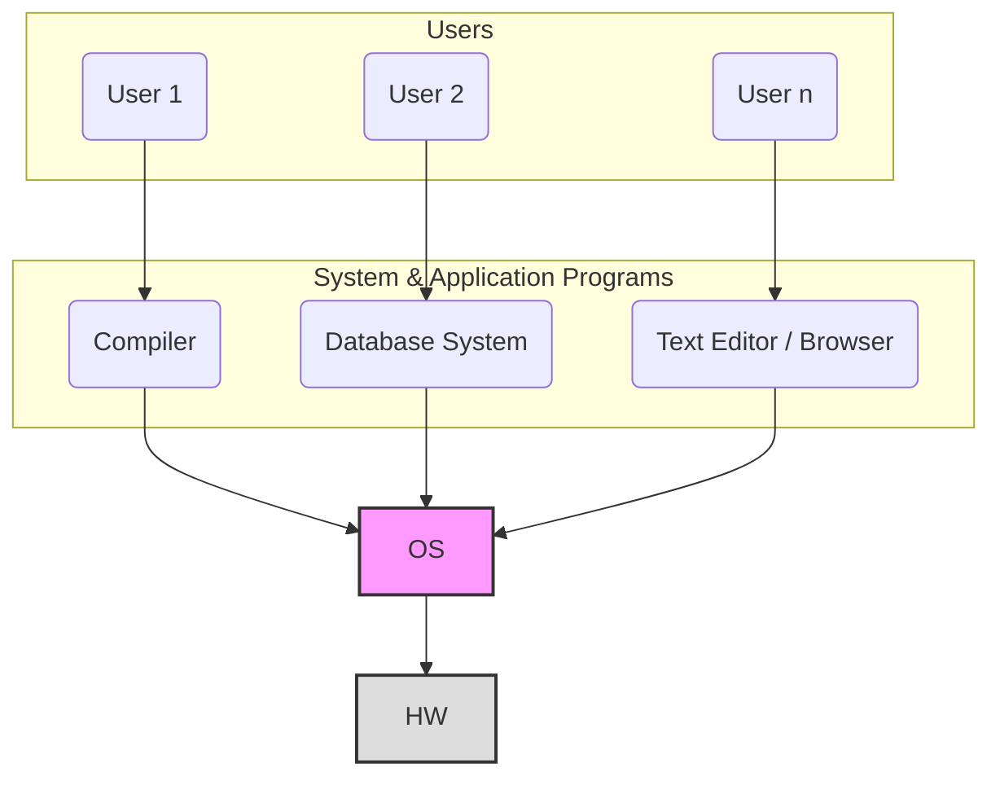
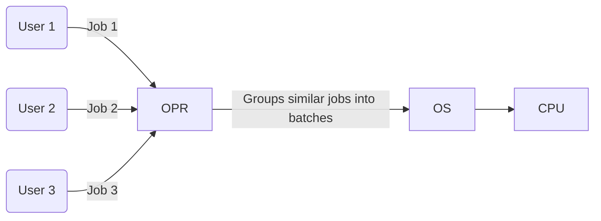
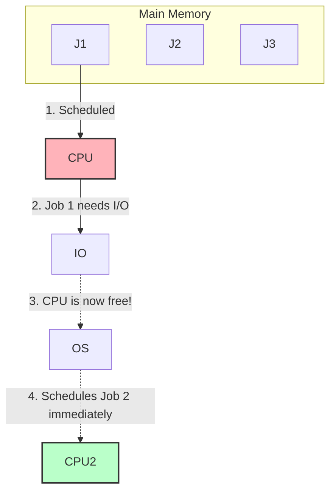
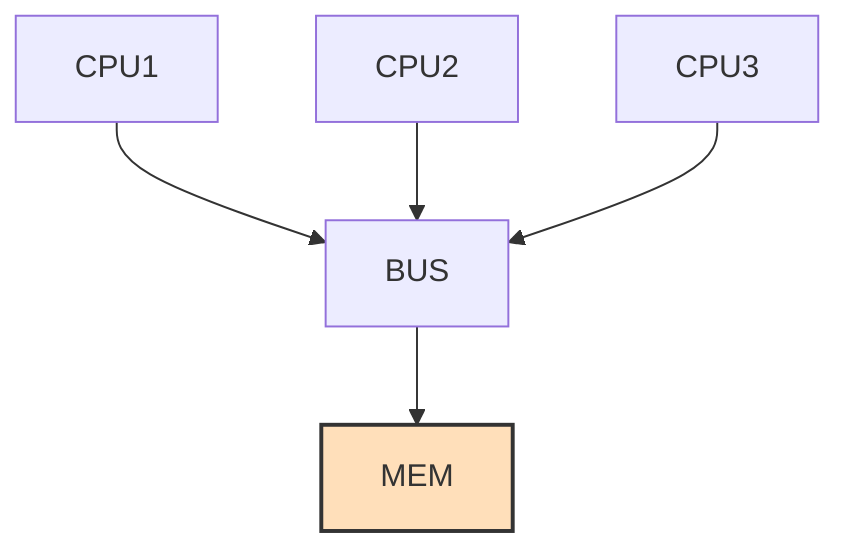
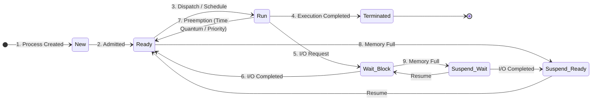
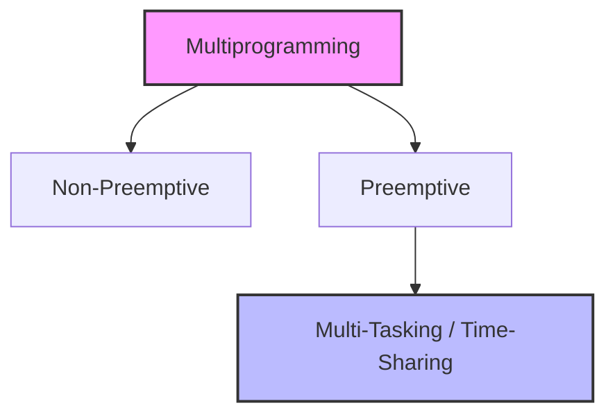

# os


---

# Operating Systems: Introduction and Background

## 1. GATE Syllabus Breakdown & Weightage
Operating Systems generally carry a significant weightage of **8 to 10 marks** in the GATE CSE exam. The syllabus and priority areas are distributed as follows:

*   **Process Management (~40% of questions):** Process concepts, CPU Scheduling (High Priority), Synchronization (High Priority), Concurrent Programming, Deadlocks, Threads.
*   **Memory Management (~40% of questions):** Main memory organization, Paging, Multilevel Paging, Segmentation, Virtual Memory.
*   **File Systems (~20% of questions):** Disk scheduling algorithms, Disk space allocation methods.

*Recommended Textbooks:* *Operating System Concepts* by Galvin, *Modern Operating Systems* by A.S. Tanenbaum.

---

## 2. What is an Operating System?

### Formal yet Intuitive Definition
An **Operating System (OS)** is a system software that acts as an **intermediary (interface)** between the user/user applications and the underlying raw computer hardware. It hides the messy details of the hardware and provides a clean, easy-to-use environment.

### Abstract View of a Computer System
To understand the interface concept, we look at the layered architecture of a computer system. 


*(Since a direct reliable image link could not be extracted via search, a Level 2 Mermaid diagram is provided for the standard abstract view).*

### Abstraction and System Calls
**Abstraction** means hiding non-essential, complex hardware details from the programmer. 

**How does abstraction happen? Through System Calls.**
A **System Call** is a programmatic request made by a user-level program to the OS to access hardware resources. 

**Professor's Example:**
```c
void main() {
    int x;
    printf("hello");     // Wants to print to the Monitor (Hardware)
    scanf("%d", &x);     // Wants to read from the Keyboard (Hardware)
}
```
*   `printf()` is a standard C library function. Internally, it invokes the **`write()` system call** to tell the OS to illuminate specific pixels on the monitor.
*   `scanf()` internally invokes a system call (like `read()`) to interact with the keyboard.
*   *Key Takeaway:* Without the OS, you would have to write hundreds of lines of binary machine code just to print "hello" to the screen. 

### OS as a Resource Manager
The OS is essentially a manager that fairly and efficiently allocates resources to active processes. 
*   **Hardware Resources:** CPU (Processor time), Main Memory (RAM), I/O Devices.
*   **Software Resources:** Files, Directories, Locks.

---

## 3. Goals of an Operating System

1.  **Primary Goal: Convenience (Ease of Use)**
    *   The system should be exceptionally user-friendly. 
    *   *Example:* **Windows OS** is designed primarily for convenience, utilizing a heavy Graphical User Interface (GUI).
2.  **Secondary Goal: Efficiency (Resource Utilization & Stability)**
    *   The system should utilize hardware resources (CPU, Memory) to their absolute maximum potential without crashing.
    *   *Example:* **Linux/UNIX** is designed primarily for efficiency and high stability, which is why it dominates the server market.

---

## 4. Types of Operating Systems (Evolution)

### I. Batch Operating System
In a Batch OS, users do not interact directly with the computer. Instead, similar jobs are grouped into "batches" by an operator and submitted to the memory. 

*   **Execution Flow:** A job requires two types of processing time: **CPU Time** (for math/logic) and **I/O Time** (for input/output operations like reading a file). 
*   **The Flaw:** If Job 1 is executing on the CPU and requires an I/O operation, it moves to the I/O devices. However, the OS **does not** schedule Job 2. The CPU sits entirely idle until Job 1 finishes its I/O and entirely completes its execution.
*   **Drawbacks:** 
    1.  **High CPU Idleness:** Poor resource utilization.
    2.  **Decreased Throughput.**



> **GATE Concept: Throughput**
> Throughput is the number of jobs completed per unit of time.
> $$Throughput = \frac{\text{Number of Jobs Completed}}{\text{Unit of Time}}$$

### II. Multiprogramming Operating System
Multiprogramming was introduced to solve the severe CPU idleness problem found in Batch Systems.
*   **Concept:** Multiple jobs are loaded into Main Memory simultaneously. The number of jobs in memory is called the **Degree of Multiprogramming**.
*   **Execution Flow:** If Job 1 is running on the CPU and requests an I/O operation, it leaves the CPU. **Immediately**, the OS Scheduler picks Job 2 from memory and assigns it to the CPU.
*   **Advantages:**
    1.  **High CPU Utilization:** The CPU is rarely idle.
    2.  **Increased Throughput.**



### III. Multitasking Operating System (Time-Sharing)
Multitasking is a logical extension of Multiprogramming.
*   **Concept:** Jobs share the CPU based on a strictly enforced **Time Quantum (Time Slice)**. 
*   **Professor's Example:** Assume a time slice of `2ns`. Job 1 runs for 2ns and gets preempted (paused). Job 2 runs for 2ns and gets preempted. Job 3 runs for 2ns, and so on in a Round-Robin fashion.
*   **The Magic:** Because the switching is so unimaginably fast ($1 ns = 10^{-9} seconds$), the human user gets the **illusion** that multiple programs (e.g., watching a Movie, downloading a Game, having a Browser open) are running exactly at the same time in parallel.
*   *Examples:* Windows, Linux, macOS.

### IV. Multiprocessor Operating System (Parallel System)
Unlike previous systems which used a single CPU, a Multiprocessor system physically contains **more than one CPU** sharing a common computer bus, clock, and memory.



**Advantages:**
1.  **Increased Throughput:** True parallel execution of tasks.
2.  **Reliability & Fault Tolerance:** Graceful degradation. If CPU 1 fails, the system does not crash; it simply continues to operate using CPU 2 and CPU 3, albeit slightly slower. 
3.  **Economical:** Buying one integrated system with 3 CPUs (sharing one motherboard, power supply, and memory) is significantly cheaper than buying 3 completely separate, standalone computers.

*Real-World Application:* Massive database servers (like IRCTC or Banking servers) utilize Multiprocessor systems because they require extremely high fault tolerance and cannot afford system downtime.

---

# Operating Systems: Process Management

## 1. Real-Time Operating Systems (RTOS)
Before diving into Process Management, we conclude the OS types with Real-Time Operating Systems.

### Definition
Systems which are **strict, deadly time-bound**. If an instruction is scheduled to execute in $2ns$, it *must* execute in exactly $2ns$. 

### Types of RTOS
1.  **Hard Real-Time OS**
    *   **Rule:** *Zero* delay is accepted. Even a minor delay of $1ns$ will cause the entire system to collapse.
    *   **Examples:** Satellite systems (ISRO's PSLV launch), Missile guidance systems. High precision and accuracy are mandatory.
2.  **Soft Real-Time OS**
    *   **Rule:** Minor delays are acceptable and will not cause a catastrophic system failure.
    *   **Example:** The Banking Sector (e.g., a 2-second delay during an ATM cash withdrawal is acceptable).

*Real-world RTOS software examples:* `SxWorks`, `VxWorks`, `RTOS` (Heavily used by ISRO and DRDO).

---

## 2. Process Concept
### Formal Definition
A **Process** is a program under execution. 

While a **Program** is *static* and *passive* (just lines of code residing on a hard disk), a **Process** is *dynamic* and *active* (taking inputs, generating outputs).

For a program to be considered "under execution" (a process), it must satisfy three conditions:
1.  It must reside in the **Main Memory** (RAM).
2.  It must be occupying the CPU to execute instructions.
3.  It must be active and dynamic.

---

## 3. Attributes of a Process & PCB
Just like humans have attributes (eyes, hands), every process has distinct attributes assigned by the OS.

1.  **Process ID (PID):** A unique identification number assigned by the OS at creation. No two active processes can have the same PID.
2.  **Process State:** Current state of the process (e.g., Ready, Running, Waiting).
3.  **Program Counter (PC):** Contains the memory address of the *next* instruction to be executed.
4.  **Priority:** A numerical value assigned for scheduling purposes (e.g., higher number = higher priority).
5.  **General Purpose Registers:** CPU registers currently holding data for the process.
6.  **List of Open Files:** Any files the process is actively reading/writing.
7.  **List of Open Devices:** Any I/O devices (like printers/scanners) requested by the process.
8.  **Protection Information:** Memory bounds and security constraints applied to the process.

> **GATE Concept: Context & Process Control Block (PCB)**
> *   The collection of all the above attributes is called the **Context of the Process**.
> *   This context is entirely stored in a data structure called the **Process Control Block (PCB)**.
> *   **Every process has its own unique PCB.**
> *   **Location:** The PCB resides in the **Main Memory**.
> *   **Implementation:** PCBs are implemented using a **Double Linked List**. Why? Because processes are created and destroyed dynamically; a linked list allows the OS to dynamically manage memory unlike a static Array.

---

## 4. Process State Diagram (Process Life Cycle)
This is the heart of Process Management. As a process executes, it changes state.



### Detailed State Breakdown:
1.  **New State:** The process is currently *being created*. (PCB is being formed). **Location:** Secondary Memory.
2.  **Ready State:** The process is fully created and is *ready* to be assigned to the CPU. 
    *   **Location:** Main Memory. 
    *   **Capacity:** Multiple processes can reside here simultaneously.
3.  **Run State:** The process is actively occupying the CPU and executing instructions.
    *   **Capacity:** Strictly **ONE** process at any given point in time (in a single-processor uniprocessor system).
4.  **Wait or Block State:** The process has voluntarily left the CPU because it requires an I/O operation (e.g., waiting for keyboard input, `scanf()`).
    *   **Location:** Main Memory.
    *   **Critical Flow:** Once I/O is complete, the process goes **back to the Ready state**, *never* directly to the Run state.
5.  **Termination/Completion:** Process execution is over. The PCB is deleted, and memory is reclaimed.
6.  **Suspend Ready & Suspend Wait (Backing Store):** If the Main Memory gets full (too many processes in Ready or Wait), the OS forces some processes out of Main Memory and swaps them into the **Secondary Memory (Backing Store)** to free up RAM. 

---

## 5. Multiprogramming vs. Multitasking (Time-Sharing)

The diagram above contains a specific transition: **Run $\rightarrow$ Ready (Preemption)**. This transition defines the type of OS.



### The Difference:
*   **All Multitasking is indirectly Multiprogramming, but not all Multiprogramming is Multitasking.**
*   **Multitasking** is specifically **Preemptive Multiprogramming**.

### What causes Preemption (Run $\rightarrow$ Ready)?
The OS forcefully snatches the CPU away from a running process under two conditions:
1.  **Priority Expiry:** A high-priority process (e.g., Priority 9) arrives in the Ready Queue while a low-priority process (e.g., Priority 1) is Running. The OS preempts the low-priority process.
2.  **Time Quantum Expiry:** In Round Robin/Time-Sharing, every process is given a strict Time Quantum (e.g., $TQ = 2ns$). Once $2ns$ is up, the process is preempted back to the Ready state, and the CPU is given to the next process.

---

## 6. Degree of Multiprogramming

> **Formal GATE Definition**
> The **Degree of Multiprogramming** is defined as the total number of processes present in the **Main Memory** at any given point of time.

*Application:* If your Main Memory contains 5 processes in the Ready state, 1 process in the Run state, and 4 processes in the Wait state, your Degree of Multiprogramming is $5 + 1 + 4 = 10$. (Note: Processes in 'New' or 'Suspend' states are in Secondary Memory and are *not* counted).